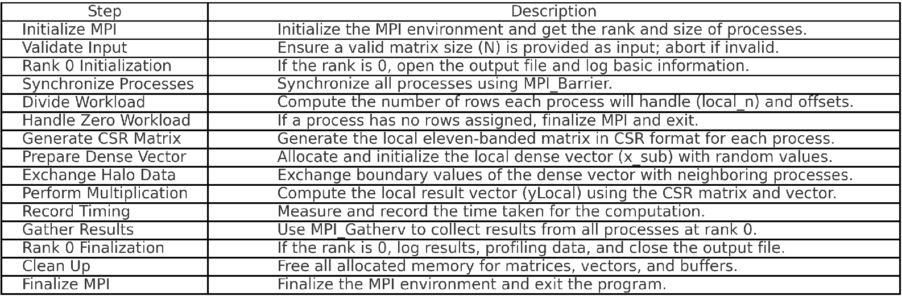

#### Sparse Eleven Banded Matrix - Dense Vector Multiplication MPI 
-Sparse matrix-vector multiplication is a crucial operation in scientific computing, machine learning and deep learning. Data that is used in computation & simulation are most in the form of sparse representations. For instance, in natural language processing words are represented as hot vectors by the method called vector embeddings. In order to optimize and increase efficiency both in terms of complexity and time, compressed sparse row scheme is used, to practically have a complexity near linear by storing only the non zero elements of matrices and leveraging locality.    	
-Implementation of such a parallel algorithm for multiplying a non-symmetric eleven-banded sparse matrix, represented in the compressed sparse row (CSR) format, with a dense vector is practiced on various sizes and approaches. In order to achieve a higher scalability, possible memory exceed that can be emerge from distribution of large data is prevented using a locally generated and a chunk based computation approach. For parallelization, message passing interface (MPI) is used. However, in order to scale and work with large size of sparse matrices, communication mechanisms should be kept as small as possible to prevent bottlenecks due to gigabytes of data size.

### Compile with: 
mpicc SpmvCSRf.c -lm -O3
### Run with: 
mpirun -np <core_size> ./a.out <matrix_size>

## Pseudo Code of The Program

program ElevenBandedSpMV

    initialize MPI environment
    get process rank and total number of processes

    validate input:
        ensure matrix size N is provided and positive
        abort if invalid

    rank 0:
        initialize output file and log basic information

    synchronize all processes

    divide the workload:
        compute rows handled by each process (local_n)
        calculate starting offset for each process

    if no rows assigned to the process:
        finalize MPI and exit

    generate random seed for reproducibility

    generate local CSR matrix:
        determine halo region for current process
        allocate and initialize CSR data structures (row_ptr, col_ind, val)
        fill CSR structure with eleven-banded matrix data

    synchronize all processes

    prepare local dense vector:
        allocate vector size based on local and halo regions
        initialize vector with random values

    exchange halo data:
        determine left and right neighbors
        exchange boundary values of the vector with neighbors
        construct extended vector including received halo data

    perform local sparse matrix-vector multiplication:
        use CSR matrix and extended vector to compute local result (yLocal)

    record computation time

    gather results at rank 0:
        rank 0:
            allocate buffers for global result and gather offsets
        use MPI_Gatherv to gather local results into global result
        log results and profiling data to output file

    clean up:
        free all allocated memory
        rank 0: close output file

    finalize MPI environment
    exit

end program

## Steps

## Conclusion
To sum up results highlight the scalability of the spmv algorithm with MPI for large matrices. The improvement in runtime with increased core counts shows the effective distribution of workload across processes and achieving a decent work load balance. However, communication overhead becomes a limiting factor as the number of processes grows especially for smaller matrices communication overlaps computation which is logically opposite of parallelization and concurrent operations. Future work would focus on optimizing process communication on distributed nodes to further enhance scalability. Additionally, PAPI metrics, such as cache miss rates, can help memory and cache inefficiencies and guide further optimization. Cache miss rate is relatively high because of irregular memory access patterns due to sparse matrices’inadequate spatial locality.  More optimization on the code using different block or tiling strategies with processing smaller chunks of data that lies in cache size to improve cache hit rate. Especially, for higher communication costs due to MPI_Send and MPI_Recv, non-blocking version of MPI calls shall be implemented. Ultimately, in order to get the best result, specialized MPI/C sparse matrix libraries could be used to have a higher performance. 